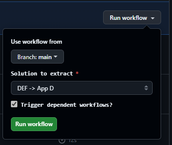
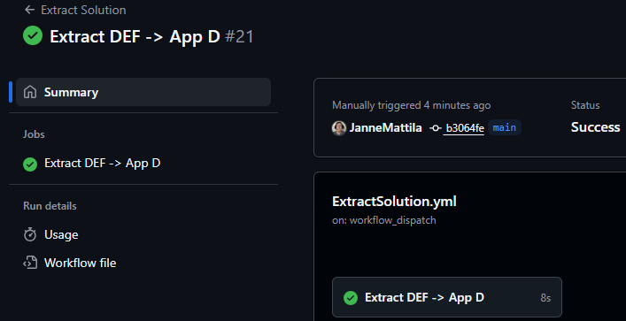
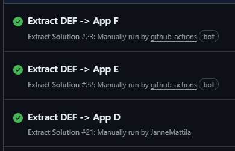
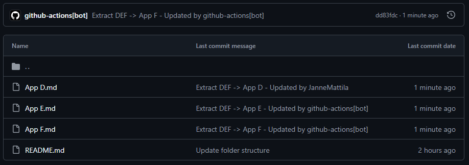

# Solution Groups

This directory contains the configuration and metadata for Solution Groups and their associated applications. Solution Groups are used to organize and manage deployments and extractions of related applications with dependency management.

## Overview

Two GitHub Actions workflows manage the Solution Groups:

1. **Deploy Solution Group** (`SolutionGroup.yml`) - Deploys applications and shows their configuration
2. **Extract Solution** (`ExtractSolution.yml`) - Updates application metadata with timestamps and commits changes

Both workflows support **cascading/dependent workflow triggering**, allowing automatic deployment or extraction of dependent applications.

## Directory Structure

```
SolutionGroups/
├── solution-groups.json          # Dependency mapping configuration
├── README.md                     # This documentation
├── ABC-SolutionGroup/            # Solution Group "ABC"
│   ├── App A.md                  # Application A configuration
│   ├── App B.md                  # Application B configuration
│   └── App C.md                  # Application C configuration
└── DEF-SolutionGroup/            # Solution Group "DEF"
    ├── App D.md                  # Application D configuration
    ├── App E.md                  # Application E configuration
    └── App F.md                  # Application F configuration
```

## Configuration File: solution-groups.json

The `solution-groups.json` file defines the dependency relationships between applications within each Solution Group.

**Structure:**
```json
{
    "SolutionGroupName": {
        "App Name": ["Dependent App 1", "Dependent App 2"],
        "Another App": []
    }
}
```

**Example:**
```json
{
    "ABC": {
        "App A": ["App B", "App C"],
        "App B": [],
        "App C": []
    }
}
```

This means:
- When "App A" is deployed/extracted with cascading enabled, it will trigger "App B" and "App C"
- "App B" and "App C" have no dependencies (empty arrays)

## Workflows

### 1. Deploy Solution Group Workflow

**File:** `.github/workflows/SolutionGroup.yml`

**Purpose:** Deploy applications and display their configuration

**Features:**
- Select a solution from dropdown (e.g., "ABC -> App A")
- Reads and displays the application's `.md` configuration file
- Optionally triggers dependent application deployments
- Uses the branch/tag selected in GitHub Actions UI

**Usage:**
1. Go to Actions → "Deploy Solution Group"
2. Click "Run workflow"
3. Select the solution to deploy (e.g., "ABC -> App A")
4. Check "Trigger dependent workflows?" to enable cascading
5. Click "Run workflow"

**Example Flow:**
- Deploy "ABC -> App A" with cascading enabled
  - Deploys App A
  - Automatically triggers deployment of App B
  - Automatically triggers deployment of App C

### 2. Extract Solution Workflow

**File:** `.github/workflows/ExtractSolution.yml`

**Purpose:** Update application metadata and commit changes

**Features:**
- Updates the first line of the application's `.md` file with timestamp and username
- Commits the change back to the repository
- Optionally triggers dependent application extractions
- Creates an audit trail of extraction activities

**Usage:**
1. Go to Actions → "Extract Solution"
2. Click "Run workflow"
3. Select the solution to extract (e.g., "DEF -> App D")
4. Check "Trigger dependent workflows?" to enable cascading
5. Click "Run workflow"

**What happens:**
- The first line of the `.md` file is updated:
  ```markdown
  # DEF-SolutionGroup -> App D - Update 2025-10-07 14:30:45 by JanneMattila
  ```
- Changes are committed by `github-actions[bot]`
- If cascading is enabled, dependent apps are also extracted

Here are screenshots of the workflows in action:

Initiate extraction of App D:



App D extraction in progress:


App D extraction completed:



It has started extraction of App E (dependent of App D) and then it will extract App F (dependent of App E):



Here is the end result after all extractions are done:



## Adding a New Solution Group

Follow these steps to add a new Solution Group (e.g., "GHI"):

### Step 1: Create the Directory Structure

```powershell
# Create the solution group directory
mkdir SolutionGroups\GHI-SolutionGroup
```

### Step 2: Create Application Files

Create a `.md` file for each application in the solution group:

```powershell
# Create application markdown files
"# GHI-SolutionGroup -> App G" | Out-File -FilePath "SolutionGroups\GHI-SolutionGroup\App G.md" -Encoding UTF8
"# GHI-SolutionGroup -> App H" | Out-File -FilePath "SolutionGroups\GHI-SolutionGroup\App H.md" -Encoding UTF8
"# GHI-SolutionGroup -> App I" | Out-File -FilePath "SolutionGroups\GHI-SolutionGroup\App I.md" -Encoding UTF8
```

**File format:**
```markdown
# <SolutionGroup>-SolutionGroup -> <AppName>

[Optional: Add application-specific configuration details here]
```

### Step 3: Update solution-groups.json

Add the new solution group to `SolutionGroups/solution-groups.json`:

```json
{
    "ABC": {
        "App A": ["App B", "App C"],
        "App B": [],
        "App C": []
    },
    "DEF": {
        "App D": ["App E"],
        "App E": ["App F"],
        "App F": []
    },
    "GHI": {
        "App G": ["App H"],
        "App H": ["App I"],
        "App I": []
    }
}
```

### Step 4: Update Workflow Files

Update **both** workflow files to include the new solution group options:

**Files to update:**
- `.github/workflows/SolutionGroup.yml`
- `.github/workflows/ExtractSolution.yml`

**Add these lines to the `options` section:**

```yaml
on:
  workflow_dispatch:
    inputs:
      solution:
        description: 'Solution to deploy'  # or 'Solution to extract'
        required: true
        type: choice
        options:
          - 'ABC -> App A'
          - 'ABC -> App B'
          - 'ABC -> App C'
          - 'DEF -> App D'
          - 'DEF -> App E'
          - 'DEF -> App F'
          - 'GHI -> App G'  # Add these new lines
          - 'GHI -> App H'
          - 'GHI -> App I'
```

### Step 5: Commit and Push

```powershell
git add SolutionGroups/
git add .github/workflows/
git commit -m "Add new Solution Group: GHI with Apps G, H, and I"
git push
```

## Adding a New App to an Existing Solution Group

Follow these steps to add a new application to an existing Solution Group:

### Step 1: Create the Application File

```powershell
# Example: Add "App X" to the "ABC" solution group
"# ABC-SolutionGroup -> App X" | Out-File -FilePath "SolutionGroups\ABC-SolutionGroup\App X.md" -Encoding UTF8
```

### Step 2: Update solution-groups.json

Add the new app to the appropriate solution group in `SolutionGroups/solution-groups.json`:

**Before:**
```json
{
    "ABC": {
        "App A": ["App B", "App C"],
        "App B": [],
        "App C": []
    }
}
```

**After:**
```json
{
    "ABC": {
        "App A": ["App B", "App C"],
        "App B": [],
        "App C": [],
        "App X": []
    }
}
```

**If you want to add dependencies:**
```json
{
    "ABC": {
        "App A": ["App B", "App C", "App X"],
        "App B": [],
        "App C": [],
        "App X": []
    }
}
```
This makes "App X" a dependency of "App A".

### Step 3: Update Workflow Files

Update **both** workflow files:

**Files to update:**
- `.github/workflows/SolutionGroup.yml`
- `.github/workflows/ExtractSolution.yml`

**Add the new option:**

```yaml
options:
  - 'ABC -> App A'
  - 'ABC -> App B'
  - 'ABC -> App C'
  - 'ABC -> App X'  # Add this new line
  - 'DEF -> App D'
  - 'DEF -> App E'
  - 'DEF -> App F'
```

### Step 4: Commit and Push

```powershell
git add SolutionGroups/ABC-SolutionGroup/App\ X.md
git add SolutionGroups/solution-groups.json
git add .github/workflows/
git commit -m "Add App X to ABC Solution Group"
git push
```

## Dependency Management

### Understanding Dependencies

Dependencies are defined as **one-way relationships** in `solution-groups.json`:

- **Parent App** → **Dependent Apps** (children)
- When you deploy/extract a parent app with cascading enabled, all dependent apps are processed automatically

### Example Dependency Chain

```json
{
    "DEF": {
        "App D": ["App E"],
        "App E": ["App F"],
        "App F": []
    }
}
```

**Execution order when deploying "App D" with cascading:**
1. Deploy App D
2. Trigger App E (dependent of App D)
3. Trigger App F (dependent of App E)

### Error Handling

Both workflows will **fail** if:
1. The application's `.md` configuration file is not found

Both workflows will **succeed** with informational messages if:
1. "Trigger dependent workflows" is enabled but the app has no dependencies defined (this is normal for leaf nodes in the dependency tree)

This ensures that configuration issues are caught early while allowing flexibility in workflow triggering.

## Best Practices

1. **Naming Convention:**
   - Solution Group directories: `<Name>-SolutionGroup/`
   - Application files: `<App Name>.md`
   - Keep names consistent with `solution-groups.json`

2. **File Headers:**
   - Always start `.md` files with: `# <SolutionGroup>-SolutionGroup -> <AppName>`
   - Extract workflow will update this header automatically

3. **Dependencies:**
   - Define dependencies in `solution-groups.json` even if empty (`[]`)
   - Test cascading with a single app before enabling for production
   - Be aware of circular dependencies (not currently prevented)

4. **Version Control:**
   - Always commit all changes together (directory, json, workflows)
   - Use descriptive commit messages
   - Test workflows after adding new solution groups/apps

## Troubleshooting

### Workflow fails with "Configuration file not found"
- Verify the file exists at: `SolutionGroups/<SolutionGroup>-SolutionGroup/<AppName>.md`
- Check for typos in folder names or file names
- Ensure file name matches exactly with `solution-groups.json` (including spaces)

### Workflow fails with "No dependent workflows found"
- This is actually not an error - it's an informational message
- Occurs when "Trigger dependent workflows" is checked but the app has no dependencies
- The workflow will succeed; this is normal for apps like "App C" or "App F" that are leaf nodes
- You can safely check "Trigger dependent workflows" for any app without worrying about this

### New app doesn't appear in dropdown
- Ensure you updated **both** workflow files (`.github/workflows/SolutionGroup.yml` and `ExtractSolution.yml`)
- Commit and push the workflow changes
- Refresh the Actions page in GitHub

### Extract workflow doesn't commit changes
- Check repository permissions in workflow settings
- Verify `permissions: contents: write` is set in the workflow file
- Ensure the `.md` file exists and is properly formatted
